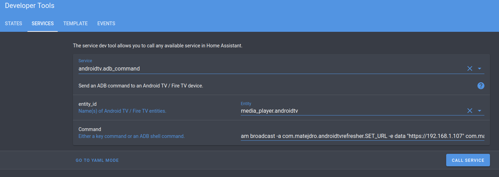

Android TV Refresher is a small Android TV utility app that pushes updates to the Home Assistant's [Android TV](https://www.home-assistant.io/integrations/androidtv/) integration.

When app is active, it turns Android TV integration [from Local Polling to Local Push](https://www.home-assistant.io/blog/2016/02/12/classifying-the-internet-of-things/#classifiers) for media state updates. 

# Installation & Configuration

1. Download [latest release apk](https://github.com/matejdro/AndroidTVRefresher/releases/latest)
2. Install apk to the Android TV (you can use any method your like - [here is one](https://www.androidpolice.com/2021/02/23/how-to-sideload-any-application-on-android-tv/))
3. Open Home Assistant
4. Open your profile
5. Scroll to the `Long-Lived Access Tokens`
6. Select `CREATE TOKEN` at the bottom
7. Enter any name (for example `Android TV`)
8. Copy token that you pops up (it will be needed later).
9. Open Developer Options
10. Select Service tab
11. Select `androidtv: ADB command` service
12. Under `entity_id` select your Android TV device
13. Under command enter 

    ```am broadcast -a com.matejdro.androidtvrefresher.SET_URL -e data "HASS_HOST" com.matejdro.androidtvrefresher/com.matejdro.androidtvrefresher.ConfigReceiver```

    but replace `HASS_HOST` with the URL of your home assistant page, **including the http(s)** (URL must be reachable from Android TV). For example:

    
14. Press `CALL SERVICE`
15. Under command enter 

    ```am broadcast -a com.matejdro.androidtvrefresher.SET_TOKEN -e data "TOKEN" com.matejdro.androidtvrefresher/com.matejdro.androidtvrefresher.ConfigReceiver```

    but replace `TOKEN` with the token that you created in step 8
14. Press `CALL SERVICE`
15. On the Android TV, open System Settings (this might)
16. Find Notification Listener settings (this might be different on every Android TV. For Shield, it is under Apps -> Special app access -> Notification access)
17. Enable AndroidTvRefresher
